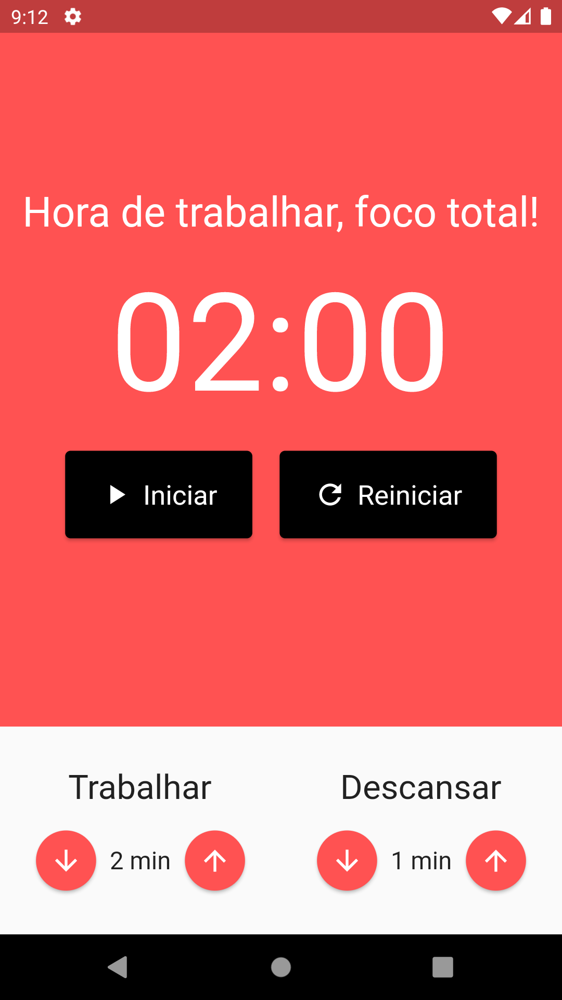
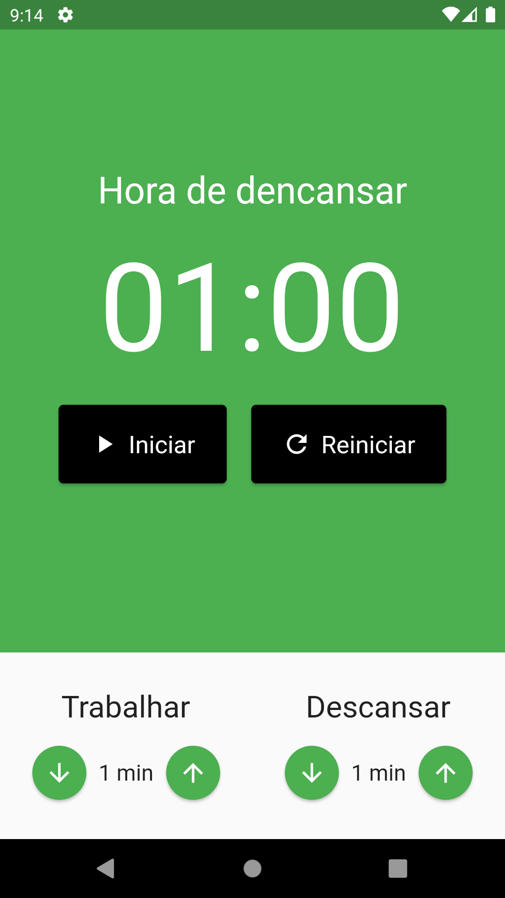

# Pomodoro App ⏱️

- Aplicação desenvolvida com Flutter para utilização da técnica de Pomodoro.

### Screenshots da aplicação:

## Rodando o app em seu computador:

### ✔️ Pré-requisitos para utilização:

- Git
- Node.js
- NPM ou YARN
- Editor de código (Visual Studio Code, Sublime, Atom, etc...)

### 1️⃣ Clone o repositório

- Abra o terminal e execute o comando abaixo:

<pre>
    <code>git clone https://github.com/Lucas98Fernando/pomodoro-app.git</code>
</pre>

### 2️⃣ Abra a pasta criada no VSCode

- Instale os plugins do Dart e do Flutter no Visual Studio Code.

### 3️⃣ Baixe as dependências

- Execute o comando abaixo no terminal na raíz do projeto:

<pre>
    <code>flutter pub get</code>
</pre>

### 4️⃣ Executando o app

- Para rodar a aplicação execute o comando abaixo no terminal na raíz do projeto:

<pre>
    <code>flutter run</code>
</pre>